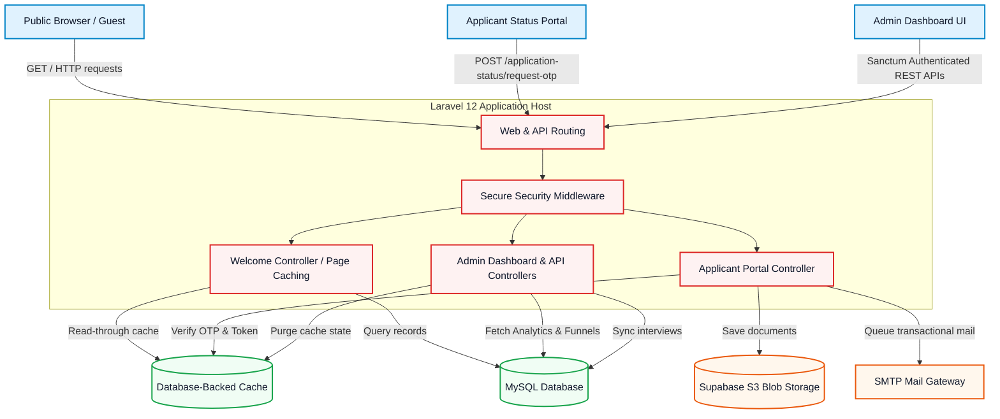
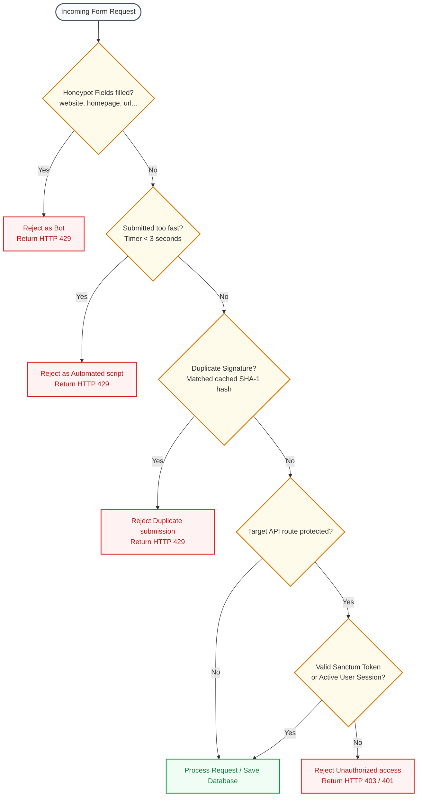
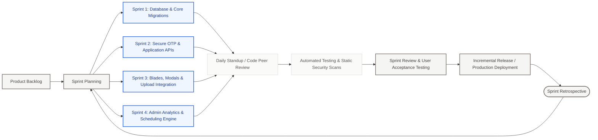
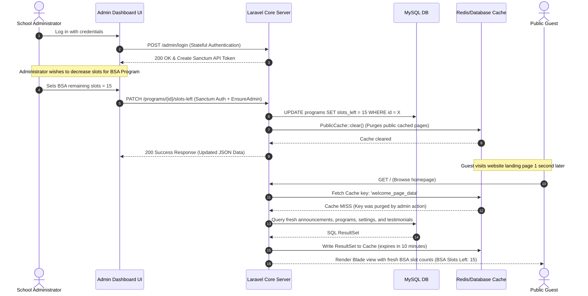

# Technical Documentation & Systems Manual: BTECH Admission Office Website

Welcome to the official technical documentation and system architecture guide for the **BTECH Admission Office Website**. This comprehensive guide provides an exhaustive breakdown of the platform's core mechanics, features, security architecture, software engineering build process, and the Agile methodology utilized throughout its lifecycle.

---

## 📌 Executive Summary & System Overview

The **BTECH Admission Office Website** is a modern, enterprise-grade admission management system built on the **Laravel 12** framework. The platform was designed to solve the challenges of manual encoding errors, fragmented documentation, and slow processing times typically found in traditional school admission offices.

By centralizing the workflow into a single web application, the system supports three distinct views:
1. **Public Website / Guest Portal**: Allows the public to discover academic programs, view recent announcements, check upcoming news/events, read testimonials, and submit contact inquiries.
2. **Online Application & Passwordless Applicant Portal**: Enables prospective students to submit applications, receive custom email receipts with unique reference numbers, log in securely via temporary 6-digit email One-Time Passwords (OTPs), check their review status, and upload critical admission documents.
3. **Protected Admin Dashboard**: Empowers school administrators to inspect granular application statistics, filter/search applicant folders, update candidate statuses, manage academic program schedules, adjust available slots, schedule/sync program interviews, edit front-facing content, and clear public caches to keep the platform performant.

---

## 🏗️ How the System Works: End-to-End Architecture

The application is architected around a highly optimized **Model-View-Controller (MVC)** and **Service Layer** pattern, separating stateful public page rendering from decoupled REST-style JSON APIs.

### 1. The Multi-Tier Caching System (High Performance Strategy)
To withstand heavy traffic spikes during peak admission seasons, the system employs a aggressive **public caching hierarchy** orchestrated by the custom `PublicCache` utility:
* **GET Content Caching**: Public resources like the landing page (`welcome_page_data`), footer programs, active announcements, news/events, and settings are cached in a fast database store for 10 minutes (`PUBLIC_CACHE_TTL`, default 600 seconds).
* **Cache-Control Headers**: The `CachePublicResponseHeaders` middleware intercepts public GET requests and adds standard client-side browser caching headers: `public, max-age=300, stale-while-revalidate=300`. This allows browsers to load pages instantly on subsequent visits while updating content in the background.
* **Smart Cache Invalidation**: The moment an administrator modifies system configurations, updates available course slots, schedules an interview, or alters front-end content, the system fires `PublicCache::clear()` to purge public caches. The next visitor receives fresh data instantly without lagging public views.

### 2. Double-State Authentication Architecture
* **Stateful Admin Auth**: The primary administrator login `/admin/login` is governed by Laravel's stateful session guard. However, to keep the administration dashboard responsive, the dashboard page `/admin/dashboard` automatically generates a secure, short-lived **Laravel Sanctum personal API token** named `admin-dashboard` on page load. This token is passed to the JavaScript frontend, which authenticates all dynamic dashboard requests against protected JSON endpoints (`/api/admin/...`) under the `auth:sanctum` middleware.
* **Sessionless OTP Applicant Auth**: Prospective students have no persistent user accounts or passwords. Instead, they authenticate on demand. Entering their unique reference number and email sends a 6-digit OTP. Once verified, a cryptographically secure 64-character token is cached for 1 hour. This token acts as a temporary, bearer authorization key for editing applications and uploading files.

---

## 🎨 Core Features Breakdown

The platform contains a robust feature set categorized by the user persona:

### 👤 Guest & Applicant Features
* **Dynamic Landing Page**: Responsive catalog of academic departments, featured student/alumni testimonials, scrolling announcement tickers, and slide-in notifications.
* **Interactive Program Finder**: Granular details for each college program, detailing curriculum duration (e.g., 4 years), schedule shifts (Day/Night), real-time slots remaining, and program-specific career opportunities.
* **Comprehensive Application Form**: Multi-step submission form collecting personal demographics, family background (parents, guardians), academic records (elementary, junior high, senior high, and college credentials), socioeconomic categories (PWD, Solo Parent, Indigenous, 4Ps), and GWA grades for grades 11 and 12.
* **Passwordless Status Portal**: Simple, elegant portal where applicants can authenticate via email OTP to view their application timeline.
* **Interactive Document Drawer**: Applicants can drag-and-drop or select file uploads (JPG, PNG, WEBP, PDF) for standard admission requirements:
  * 2x2 ID Photo
  * Birth Certificate
  * HS Report Card / Form 138
  * Certificate of Good Moral Character
  * Transcript of Records (TOR) / Diploma (for transfer students)
* **Automated Transactions**: Immediate notification emails dispatched upon successful form submission and interview bookings.

### 🛡️ Administrator Features
* **KPI Analytics Dashboard**: Rich data panel depicting:
  * Real-time metrics (Total, Pending, Approved, Rejected, and Under Interview).
  * Demographic breakdowns (Percentage of PWDs, Solo Parents, Indigenous Peoples, and 4Ps beneficiaries).
  * Funnel conversion metrics (Applied ➔ Reviewed ➔ Interviewed ➔ Admitted).
  * Submission trend lines aggregated monthly.
  * Interactive hourly heatmap highlighting peaks in student activity.
* **Applicant Folder Viewer**: Centralized directory listing student dossiers with advanced search filters, status logs, and custom text inputs for administrative notes.
* **Program Schedule & Slot Planner**: Controls available courses, capacity caps, and program visibility. The system automatically toggles a course to "disabled" when slots reach 0 and reactivates it if a reservation is cancelled.
* **Interview Sync Scheduler**: A bulk schedule optimizer. Admins select a program, and the system pulls matching applicants. Schedules can be synced, edited, or updated in bulk. Modifying schedules automatically notifies the student via a dynamic email layout.
* **Dynamic Content Management (CMS)**: Instant management of school announcements, news stories, events calendar, faculty rosters, staff details, and student testimonials.
* **System Settings & Cache Purger**: Direct control panel for platform toggles (e.g., toggle accepting applications, enable/disable email notifications) and a one-click manual cache purge button.

---

## 🔒 Security Architecture & Hardening Measures

Security was built into the foundation of the platform rather than added as an afterthought. Below are the primary security implementations protecting both the database and client-side applications.

### 1. Anti-Spam and Bot Prevention Pipeline
All public write actions (such as submitting inquiries or applications) pass through the custom `PreventPublicFormSpam` middleware:
* **Honeypot Trap**: Invisible inputs (like `website`, `homepage`, `company`, `url`, and `_hp`) are embedded in form layouts. Normal users cannot see or fill these out, but automated spam bots scrape and populate them. If any honeypot input is filled, the request is immediately logged and dropped with a `429 Too Many Requests` code.
* **Cryptographic Timing Check**: Forms embed a timestamp `_form_started_at` when rendered. Upon post-back, the middleware checks if the elapsed time is less than 3 seconds. Since bots parse and submit fields instantaneously, this catches automated scripts.
* **Idempotency Duplicate Blocking**: To prevent double-clicks or flood attacks, the middleware generates a SHA-1 hash signature of the request payload sorted alphabetically combined with the visitor's IP and route path. This signature is cached for 5 minutes. Any incoming request with an identical signature within this window is rejected, ensuring database sanity.

### 2. Passwordless Applicant Portal Security
* **Timing-Attack Proof Verification**: The generated 6-digit OTP code is stored as a secure **SHA-256 hash** in the database cache. When verified, the system compares the hashes using PHP's `hash_equals()` method, which performs a constant-time string comparison to neutralize timing attacks.
* **Token Cryptographic Signatures**: The 64-character bearer token provided after verification is stored in the database cache as a hashed value `applicant_portal_session:{sha256(token)}`. Even if the database cache is leaked, an attacker cannot reverse-engineer the session tokens.
* **Upload Isolation**: To upload documents, applicants must provide their original 64-character token. The system verifies this token against the hashed token stored in the specific application row (`document_upload_token`), ensuring applicants can only upload files into their own records.

### 3. Attack Surface Reduction & Hardening
* **Content Security Policy (CSP)**: The customized `SecureHeaders` middleware forces a strict Content Security Policy. It restricts resource loading to trusted domains (`self`), allows safe script integrations, and disables embed parameters (`frame-ancestors 'none'`) to prevent **Clickjacking** attacks.
* **MIME Sniffing Prevention**: Sets the header `X-Content-Type-Options: nosniff` to prevent browsers from parsing files into dangerous executable scripts.
* **X-Frame-Options**: Set to `DENY` globally to block the site from being hosted inside malicious frames or iframes.
* **Permissions Policy**: Hardens browser interactions by explicitly disabling access to hardware interfaces (`camera=(), microphone=(), geolocation=(), payment=()`).
* **HSTS Configuration**: Enforces HTTPS transport security (`Strict-Transport-Security`) with subdomains and preload flags for production environments.
* **Rate Limiting Middleware**: Custom rate limiters throttle API endpoints to prevent brute-force attacks (e.g. `throttle:api-login` for logins, `throttle:document-upload` for file uploads).

### 4. Admin Role Hardening
* **Middleware Authentication**: All admin routes are locked behind both Laravel Sanctum token auth and the custom `EnsureAdmin` middleware.
* **Admin Verification Logic**: The `User` model's `isAdmin()` method uses secure string checks (`hash_equals`) against a server-only environment variable (`ADMIN_EMAIL`) combined with database role verification. This prevents basic SQL injection or model manipulation bypasses.

### 5. Global Request Input Sanitization (XSS & Script Injection Prevention)
To guard against Cross-Site Scripting (XSS) and arbitrary HTML Injection across the application's extensive entry points, the system executes a recursive global middleware filter `SanitizeRequestInput`:
* **Recursive Payload Traversing**: All incoming requests (both standard forms and nested JSON API payloads) are scanned recursively at the request layer before routing to any controller or database transactions.
* **Advanced Script & Iframe Stripping**: Employs strict regular expressions (`/<script\b[^>]*>(.*?)<\/script>/is` and `/<iframe\b[^>]*>(.*?)<\/iframe>/is`) to completely delete malicious elements *and* their interior javascript execution contents, ensuring raw payloads are neutralized.
* **HTML Tag Purging**: Runs strings through `strip_tags()` to completely purge any other remaining structural HTML tags, keeping the stored data strictly plain-text.
* **Credential Complexity Protection**: Explicitly bypasses security-sensitive password strings (e.g., `password`, `password_confirmation`, `current_password`) to preserve special complexity characters during authentications.

---

## 🛠️ How It Was Built (The Tech Stack & Dependencies)

The codebase was assembled using industry-standard packages, frameworks, and modern asset management pipelines.

### 1. The Core Tech Stack
* **PHP 8.2+**: Leveraging strict types, match expressions, and constructor property promotion.
* **Laravel 12 (MVC)**: Utilizing standard Eloquent ORM, DB Transactions, database-backed Caches, Blade Templating, Laravel Breeze, and Laravel Mail notifications.
* **MySQL**: Powering the transactional database engine with clean primary and foreign key constraints, indexes on search query vectors (e.g., indexes on application status, email, reference number), and transactional isolation levels.
* **Tailwind CSS v3**: Clean utility-first styling with responsive breakpoint grids.
* **Alpine.js**: Ultra-lightweight reactive framework powering client-side interactive widgets, status checkers, drawer transitions, and dynamic modals.
* **Vite**: Rapid, modern asset compilation and hot module reloading.

### 2. Production Integrations
* **Supabase S3 Cloud Storage**: Managed cloud file storage. Files uploaded are isolated, renamed to randomized UUIDs, and uploaded via the AWS S3 Flysystem client (`league/flysystem-aws-s3-v3`). Public URLs are resolved on-the-fly via custom model attribute mutators.
* **Transactional Email Gateway**: SMTP Mail integration providing secure transmissions of OTPs, submission receipts, and interview bookings.

### 3. Engineering Automation & Scripts
The project features specialized NPM and Composer script pipelines to automate setups and protect environments:
* **One-Command Developer Setup**: `composer run setup` completely automates workspace installations by running `composer install`, copying `.env.example`, generating application keys, executing database migrations, installing NPM packages, and compiling assets.
* **Concurrently Managed Dev Servers**: `composer run dev` spins up a unified development console managing the web server, the Laravel queue listener, the realtime logs tailer (`laravel/pail`), and the Vite asset bundler simultaneously.
* **Static Secret Leak Scanner**: A custom static analysis script (`node scripts/scan-secrets.js`) checks files under `public` and `resources` directories before commits or deployments. It scans for server-only environment variable names and regex patterns matching raw JWTs, private keys, or API tokens to prevent developers from exposing server credentials in bundle files.

---

## 🔄 The Agile Methodology Used

The application was built following the **Agile Scrum framework**, enabling iterative development, rapid testing, and continuous feedback loops.

### 1. Sprint Cycles & Iterative Delivery
The platform was built across 4 distinct 2-week Sprints:
* **Sprint 1: Data Architecture & Core Setup**
  * *Focus*: Setting up Laravel 12, configuring Tailwind/Vite, creating core tables (users, applications, programs, cache), and building raw seeders.
  * *Deliverable*: A working database schema and basic administrative migrations.
* **Sprint 2: Secure Backend REST API Services**
  * *Focus*: Coding controller logics (`ApplicationController`, `AuthController`), establishing rate limiters, coding OTP and sessionless token managers, and integrating Supabase S3 storage configurations.
  * *Deliverable*: Decoupled APIs tested via manual tools and automated feature testing scripts.
* **Sprint 3: Front-End Guest Pages & The Applicant Portal**
  * *Focus*: Building interactive Blade layouts, programming Alpine.js logic for multi-step applications, styling responsiveness, and wiring OTP forms.
  * *Deliverable*: Fully functional public-facing website and secure status checking dashboard.
* **Sprint 4: Admin KPI Dashboards & Interview Engines**
  * *Focus*: Writing complex Eloquent SQL aggregates for KPI counts, submission funnels, monthly trends, and heatmaps. Building the dynamic interview sync grid.
  * *Deliverable*: Complete, protected dashboard panel.

### 2. Quality Assurance & Continuous Compliance
* **Automated PHPUnit Feature Testing**: Feature routes are covered by PHPUnit integration tests (`AdminRoutingTest.php` and `PublicRoutingTest.php`). These test pages and APIs under mock database connections, verifying that middleware throws expected redirects, authentication scopes restrict operations, and files serve with precise content types.
* **Git Pre-Commit Quality Checks**: Before code is marked ready for staging, the automated secret static analyzer (`scan:secrets`) and PHP syntax linter run to ensure zero vulnerability or coding standard deviations.
* **Continuous Feedback Integration**: Using Agile retrospectives, developers and school administrators met at the end of each sprint. This led to key UX refinements, such as changing the upload portal layout to a visual side drawer and adding an auto-saving state indicator.

---

## 📈 Platform Flowcharts & Lifecycle Diagrams

Below are the detailed operational flowcharts of the system.

### 1. End-to-End Application Lifecycle (Applicant Perspective)
This chart outlines the sequence of states an applicant advances through from first visit to final enrollment.

```mermaid
stateDiagram-v2
    [*] --> Guest_Visitor : Browse homepage, announcements, requirements, programs
    Guest_Visitor --> Starting_Application : Clicks 'Apply Now'
    
    state Starting_Application {
        [*] --> Filling_Demographics
        Filling_Demographics --> Choosing_Programs : Selects first and second choice
        Choosing_Programs --> Submission_Check : Validates all fields are entered
    }

    Submission_Check --> Application_Submitted : POST /applications/submit-public
    Application_Submitted --> Requesting_OTP : Wants to check portal status
    Requesting_OTP --> Email_Sent : System sends 6-digit OTP code to applicant's inbox
    Email_Sent --> Verify_OTP : Applicant enters OTP in browser portal
    Verify_OTP --> Portal_Dashboard : Correct OTP matches database hash (Active Session)
    
    state Portal_Dashboard {
        [*] --> Reviewing_Status
        Reviewing_Status --> Uploading_Documents : Clicks upload drawer (PDF/images)
        Uploading_Documents --> System_Saves_S3 : Streamed to Supabase S3 bucket
        System_Saves_S3 --> Reviewing_Status
    }

    Portal_Dashboard --> Under_Review : Admin marks folder as 'Under Review'
    Under_Review --> For_Interview : Admin schedules interview slot (Auto-email sent)
    For_Interview --> Approved : Candidate passes interview check
    Approved --> Accepted : Candidate confirms admission offer
    Accepted --> Enrolled : Registrars complete candidate onboarding
    Enrolled --> [*]
```

### 2. Administrative Control & Settings Loop
This chart maps the administrative management cycle and the public page caching boundaries.

---

*This documentation is maintained by the development team. For architectural proposals, database changes, or server operations, refer to the development guidelines.*
